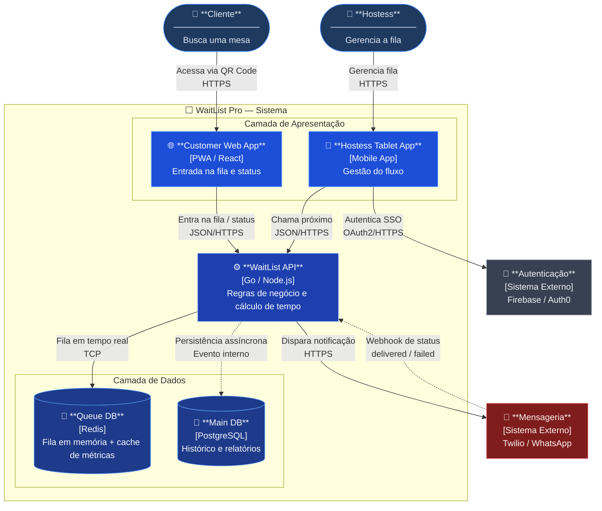

# Visão de Containers (C4 Model)

Para garantir escalabilidade na leitura em tempo real e resiliência, a arquitetura separa bancos de dados e utiliza comunicações assíncronas para saídas lentas.

```mermaid
flowchart TB
    %% ── ATORES ──────────────────────────────────────────────────────────────
    customer(["👤 **Cliente**\n──────────────\nBusca uma mesa"])
    hostess(["👤 **Hostess**\n──────────────\nGerencia a fila"])

    %% ── SISTEMAS EXTERNOS ──────────────────────────────────────────────────
    auth["🔑 **Autenticação**\n[Sistema Externo]\nFirebase / Auth0"]
    messaging["📨 **Mensageria**\n[Sistema Externo]\nTwilio / WhatsApp"]

    %% ── SISTEMA WAITLIST PRO ────────────────────────────────────────────────
    subgraph boundary["⬜ WaitList Pro — Sistema"]
        direction TB

        subgraph row1["Camada de Apresentação"]
            direction LR
            customerApp["🌐 **Customer Web App**\n[PWA / React]\nEntrada na fila e status"]
            hostessApp["📱 **Hostess Tablet App**\n[Mobile App]\nGestão do fluxo"]
        end

        api["⚙️ **WaitList API**\n[Go / Node.js]\nRegras de negócio e cálculo de tempo"]

        subgraph row2["Camada de Dados"]
            direction LR
            redis[("🔴 **Queue DB**\n[Redis]\nFila em memória + cache de métricas")]
            db[("🐘 **Main DB**\n[PostgreSQL]\nHistórico e relatórios")]
        end
    end

    %% ── RELACIONAMENTOS ─────────────────────────────────────────────────────
    customer -->|"Acessa via QR Code\nHTTPS"| customerApp
    hostess  -->|"Gerencia fila\nHTTPS"| hostessApp

    %% FIX C4-1: App autentica, não o humano
    hostessApp -->|"Autentica SSO\nOAuth2/HTTPS"| auth

    customerApp -->|"Entra na fila / status\nJSON/HTTPS"| api
    hostessApp  -->|"Chama próximo\nJSON/HTTPS"| api

    api -->|"Fila em tempo real\nTCP"| redis

    %% FIX C4-2: Persistência assíncrona (via fila interna)
    api -.->|"Persistência assíncrona\nEvento interno"| db

    api -->|"Dispara notificação\nHTTPS"| messaging

    %% FIX NEW-3: Callback de status de entrega
    messaging -.->|"Webhook de status\ndelivered / failed"| api

    %% ── ESTILOS ─────────────────────────────────────────────────────────────
    classDef person   fill:#1e3a5f,stroke:#3b82f6,color:#e2e8f0,rx:50
    classDef app      fill:#1d4ed8,stroke:#60a5fa,color:#f8fafc
    classDef api_svc  fill:#1e40af,stroke:#93c5fd,color:#f8fafc
    classDef db_node  fill:#1e3a8a,stroke:#60a5fa,color:#f8fafc
    classDef ext_sys  fill:#374151,stroke:#9ca3af,color:#f3f4f6
    classDef ext_msg  fill:#7f1d1d,stroke:#f87171,color:#fef2f2

    class customer,hostess person
    class customerApp,hostessApp app
    class api api_svc
    class redis,db db_node
    class auth ext_sys
    class messaging ext_msg
```
