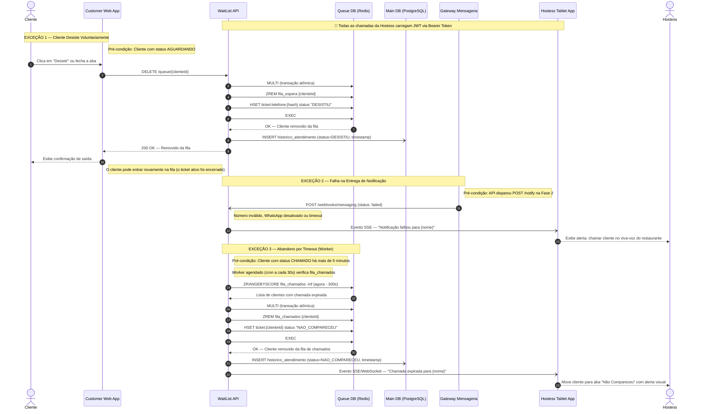

# Diagrama B — Tratamento de Exceções

Este diagrama documenta os **caminhos alternativos e de erro** do sistema: desistência voluntária do cliente, abandono por timeout, e falha no envio de notificações. Representa as transições de exceção (`AGUARDANDO → DESISTIU` e `CHAMADO → NAO_COMPARECEU`).

