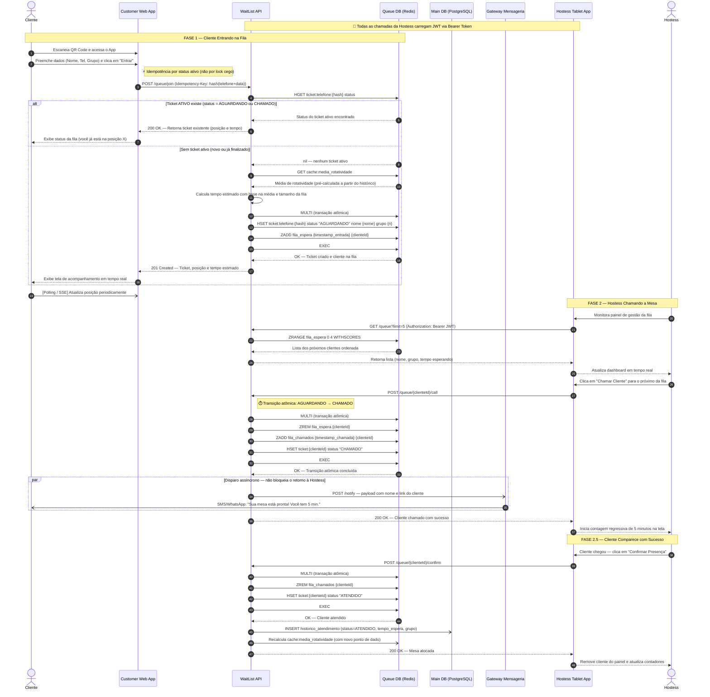

# Diagrama de Sequência A — Caminho Feliz (Happy Path)

Este diagrama documenta o **ciclo de vida bem-sucedido** de um ticket de fila: o cliente entra, a hostess chama, e o cliente comparece para ser atendido. Representa o fluxo principal do sistema (`AGUARDANDO → CHAMADO → ATENDIDO`).

